They mark the paradigm shift from scaling `train-time compute` to scaling `test-time compute`.

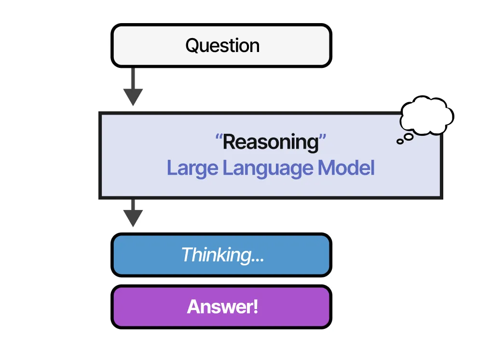

# What are reasoning LLMs?
Compared to regular LLMs, reasoning LLMs tend to break down a problem into smaller steps (often called reasoning steps or thought processes) before answering a given question.

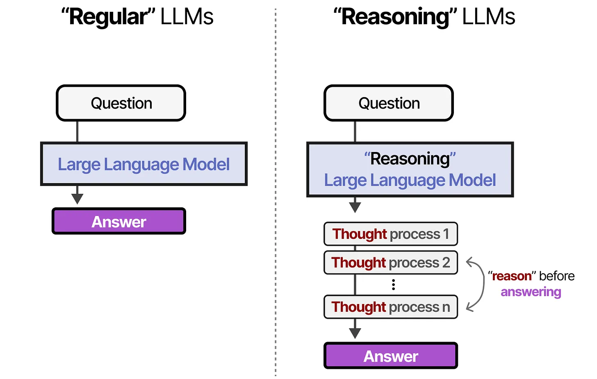

Although we can philosophize whether LLMs are actually able to think like humans, these reasoning steps break down the process into smaller, structured inferences.

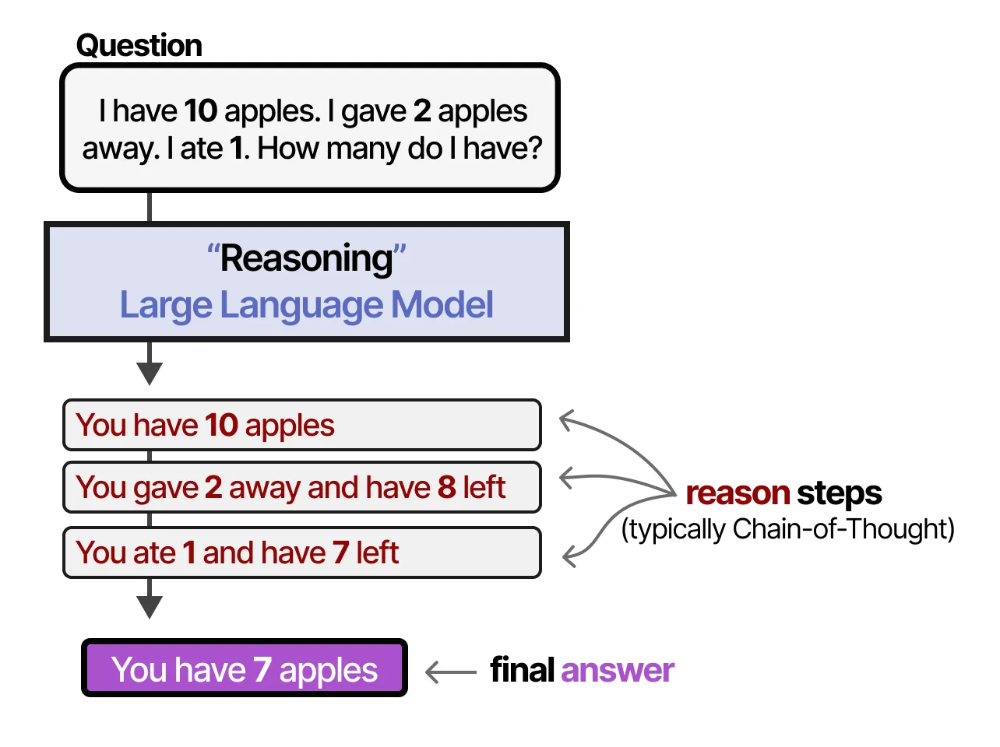

In other words, instead of having LLMs learn “what” to answer they learn “how” to answer!

To understand how reasoning LLMs are created, we first explore the paradigm shift from a focus on scaling training (train-time compute) to inference (test-time compute).

# What is train-time compute?

Until half of 2024, to increase the performance of LLMs during pre-training, developers often increase the size of the:

- Model (# of parameters)
- Dataset (# of tokens)
- Compute (# of FLOPs)

Combined, this is called train-time compute, which refers to the idea that pretraining data is the “fossil fuel of AI”. Essentially, the larger your pretraining budget, the better the resulting model will be.

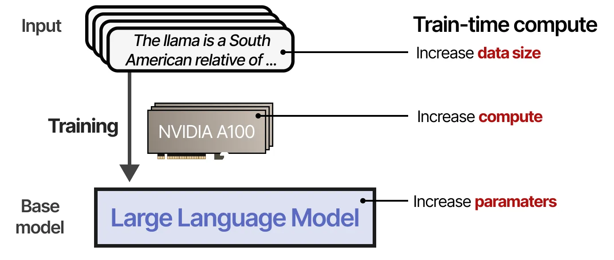

Train-time compute may include both the compute needed during training as well as during fine-tuning.

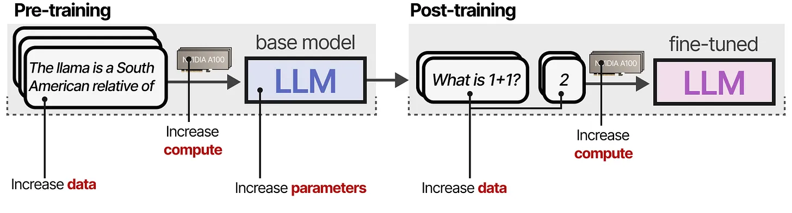

Together, they have been a main focus on increasing the performance of LLMs.

## Scaling Laws

How a model’s scale (through compute, dataset size, and model size) correlates with a model’s performance is researched through various scaling laws.

They are so-called “power laws” where an increase in one variable (e.g., compute) results in a proportional change in another variable (e.g., performance).

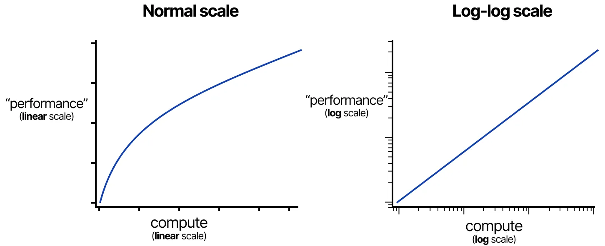

These are typically shown in a log-log scale (which results in a straight line) to showcase the large increase in compute.

Most well-known are the “Kaplan” and “Chinchilla” scaling laws. These laws more and less say that the performance of a model will increase with more compute, tokens, and parameters.

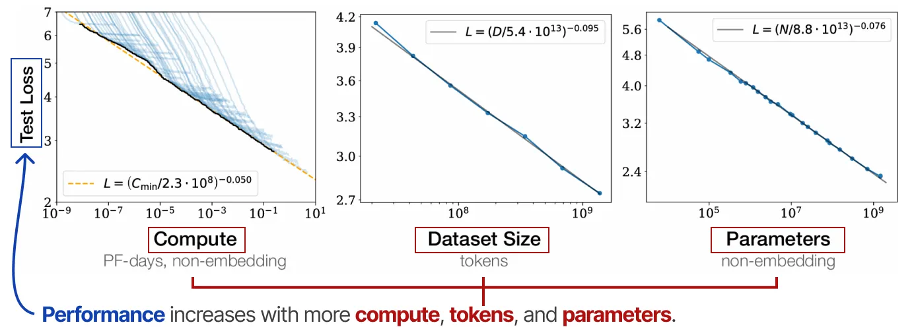

> Annotated figure of the “Scaling laws for neural language models” paper. It shows how performance may increase with different measures of compute (longer training, dataset size, and parameter size).

They suggest that all three factors must be scaled up in tandem for optimal performance.

Kaplan’s Scaling Law states that scaling the model’s size is typically more effective than scaling data (given fixed compute). In contrast, the Chinchilla Scaling Law suggests that the model size and data are equally important.

However, throughout 2024, compute, dataset size and model parameters have steadily grown, yet the gains have shown diminishing returns.

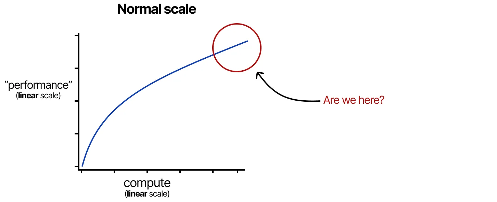

As is with these power laws, there are diminishing returns as you scale up.

This raises the question:

---
> “Have we reached a wall?”
---

# What is test-time Compute?

The expensive nature of increasing train-time compute led to an interest in an alternative focus, namely test-time compute.

Instead of continuously increasing pre-training budgets, test-time compute allows modes to “think longer” during inference.

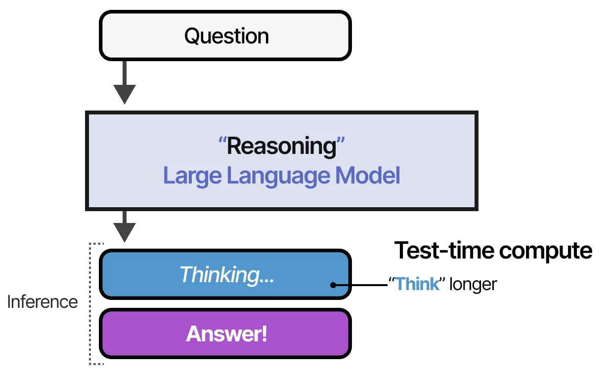

With non-reasoning models, it would normally only output the answer and skip any “reasoning” steps:

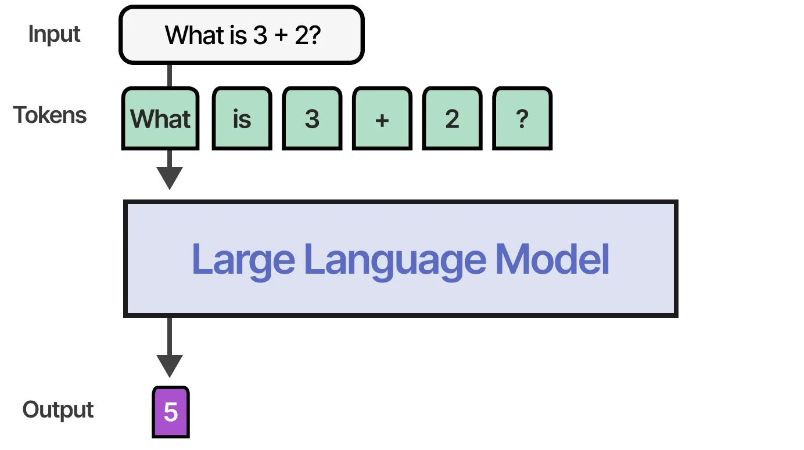

Reasoning models, however, would instead use more tokens to derive their answer through a systematic “thinking” process:

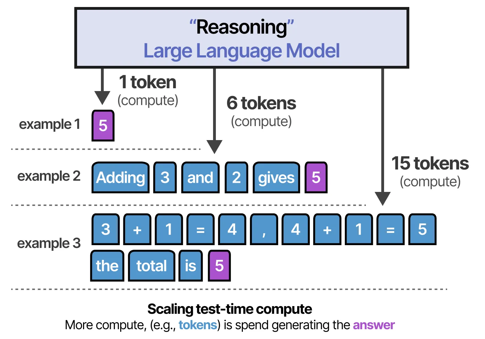

The idea is that the LLM has to spend resources (like VRAM compute) to create an answer. However, if all compute is spent generating the answer, then that is a bit inefficient!

Instead, by creating more tokens beforehand that contain additional information, relationships, and new thoughts, the model spent more compute generating the final answer.

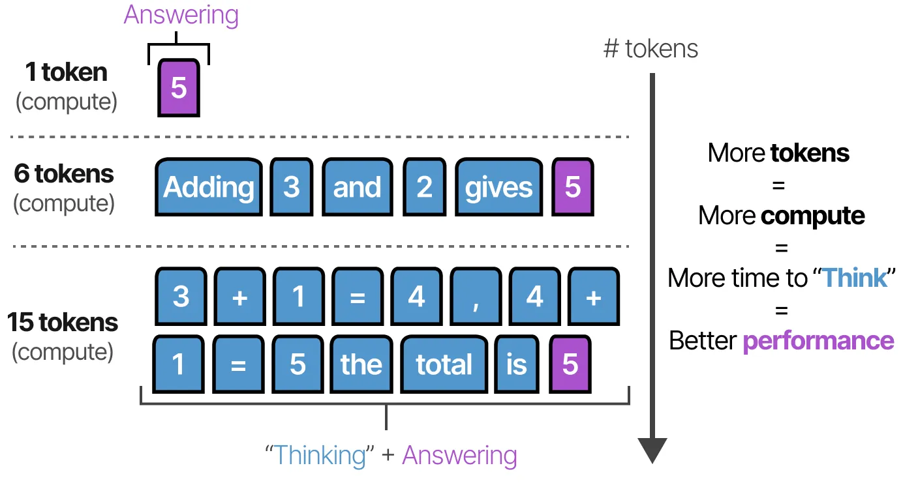

## Scaling Laws

Compared to train-time compute, scaling laws for test-time compute are relatively new. Of note are two interesting sources that relate test-time compute scaling to train-time compute.

First, is a post by OpenAI showcasing that test-time compute might actually follow the same trend as scaling train-time compute.

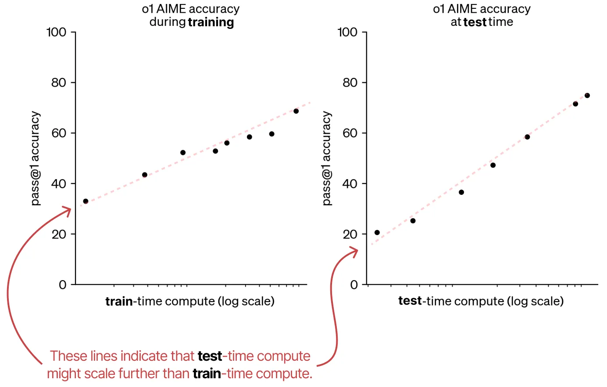

> Annotated figure from “Learning to reason with LLMs”. The red dotted line was added to demonstrate how OpenAI suggests the new paradigm might be test-time compute.

As such, they claim that there might be a paradigm shift to scaling test-time compute as it is still a new field.

Second, an interesting paper called “Scaling Scaling Laws with Board Games”4, explores AlphaZero and trains it to various degrees of compute to play Hex.

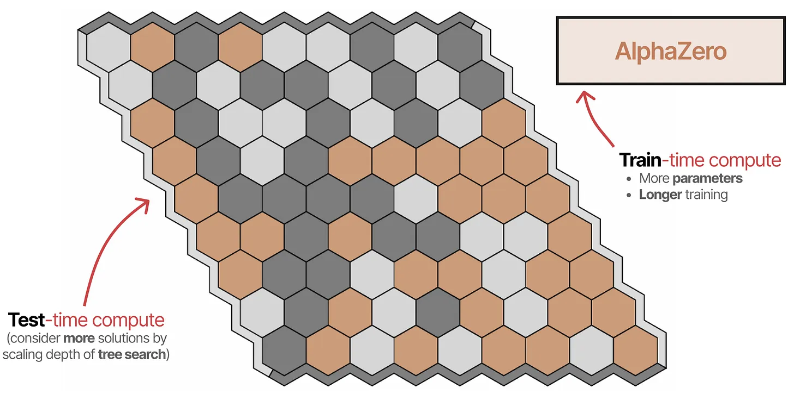

> Annotated figure from “Scaling Scaling Laws with Board Games”. It shows how they constructed varying degrees of train-time compute and test-time compute.

Their results show that train-time compute and test-time compute are tightly related. Each dotted line showcases the minimum compute needed for that particular ELO score.

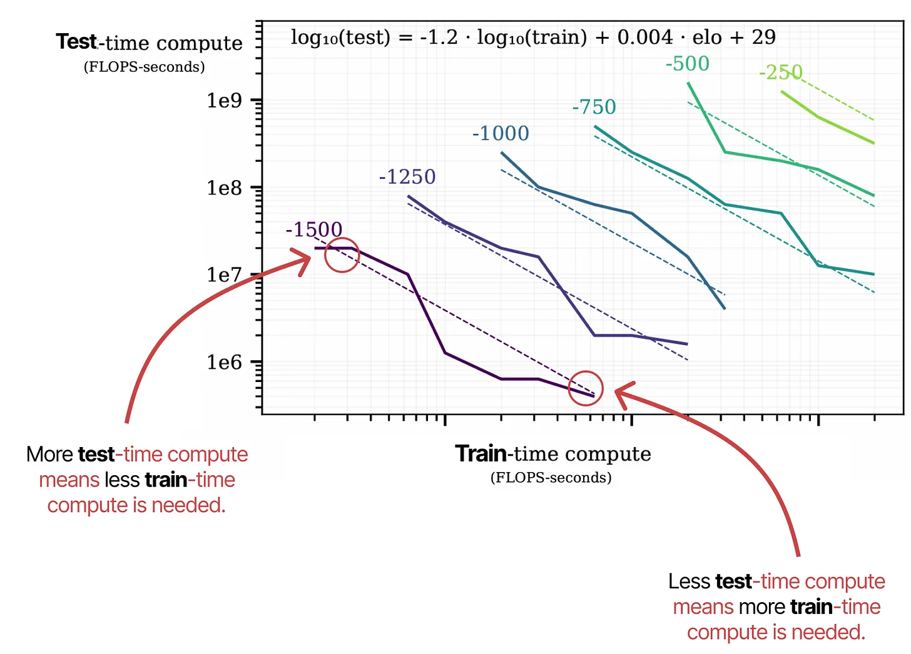

> Annotated figure from “Scaling Scaling Laws with Board Games”. It demonstrates the relationship between train-time compute and test-time compute.

With test-time compute scaling like train-time compute, a paradigm shift is happening toward “reasoning” models using more test-time compute.

Through this paradigm shift, instead of focusing purely on train-time compute (pre-training and fine-tuning), these “reasoning” models instead balance training with inference.

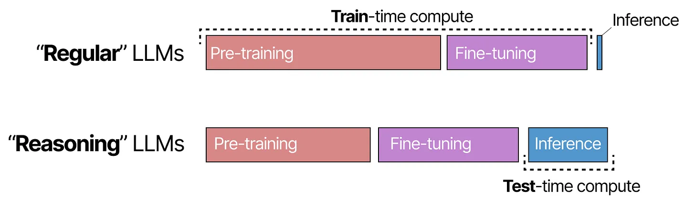

Test-time compute could even scale in length:

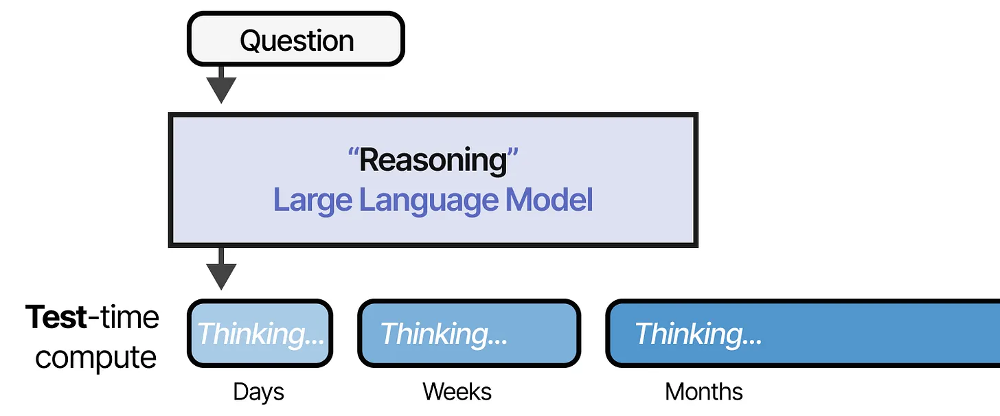

Scaling in length is something we will also explore when diving into DeepSeek-R1!

Categories of Test-time Compute
The incredible success of reasoning models like DeepSeek R-1 and OpenAI o1 showcase that there are more techniques than simply thinking “longer”.

As we will explore, test-time compute can be many different things, including Chain-of-Thought, revising answers, backtracking, sampling, and more.

These can be roughly put into two categories5:

Search against Verifiers (sampling generations and selecting the best answer)

Modifying Proposal Distribution (trained “thinking” process)

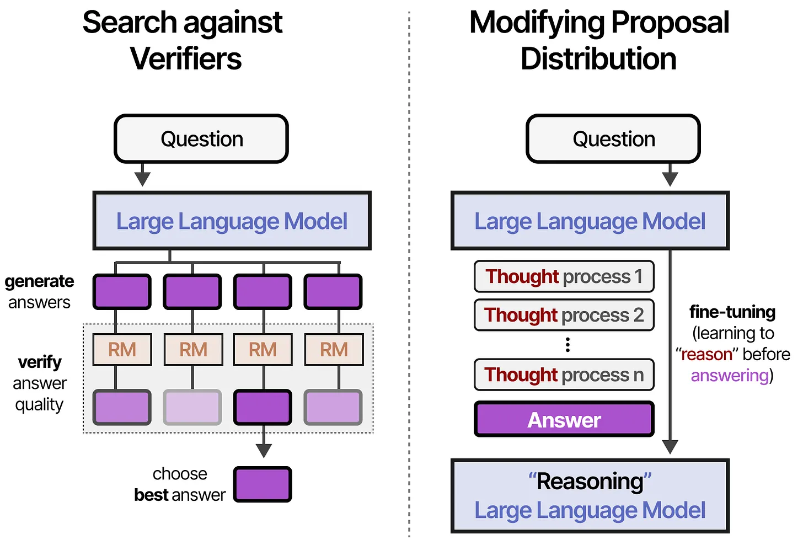

Thus, search against verifiers is output-focused whereas modifying the proposal distribution is input-focused.

There are two types of verifiers that we will explore:

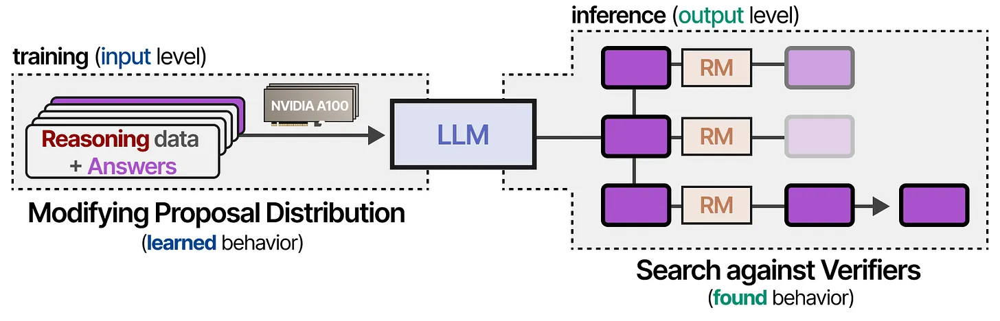

- Outcome Reward Models (ORM)
- Process Reward Models (PRM)

As their names imply, the ORM only judges the outcome and doesn’t care about the underlying process:

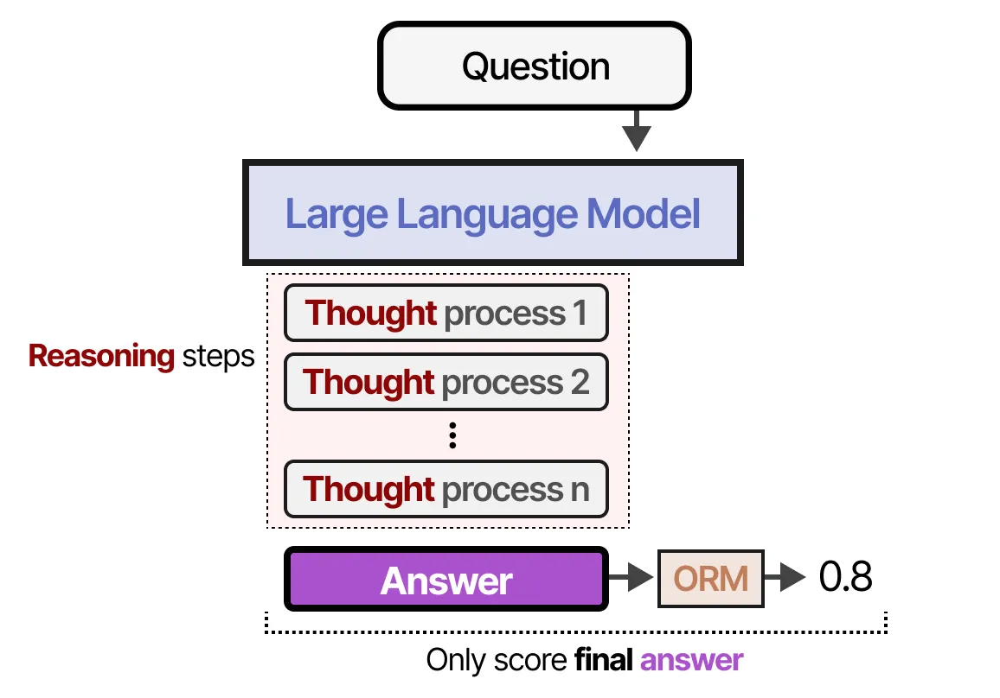

In contrast, the PRM also judges the process that leads to the outcome (the “reasoning”):

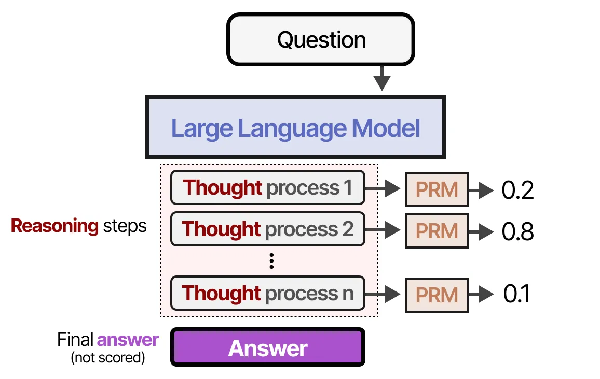

To make these reasoning steps a bit more explicit:

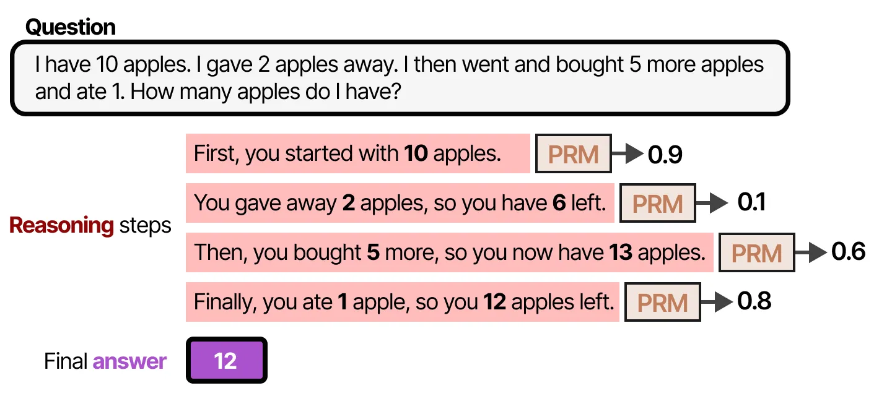

Note how step 2 is a poor reasoning step and is scored low by the PRM!

Now that you have a good grasp on ORMs vs. PRMs, let us explore how they can applied in various verification techniques!

## Search against Verifiers

The first major category of test-time compute is to search against verifiers. This generally involves two steps.

- First, multiple samples of reasoning processes and answers are created.
- Second, a verifier (Reward Model) scores the generated output

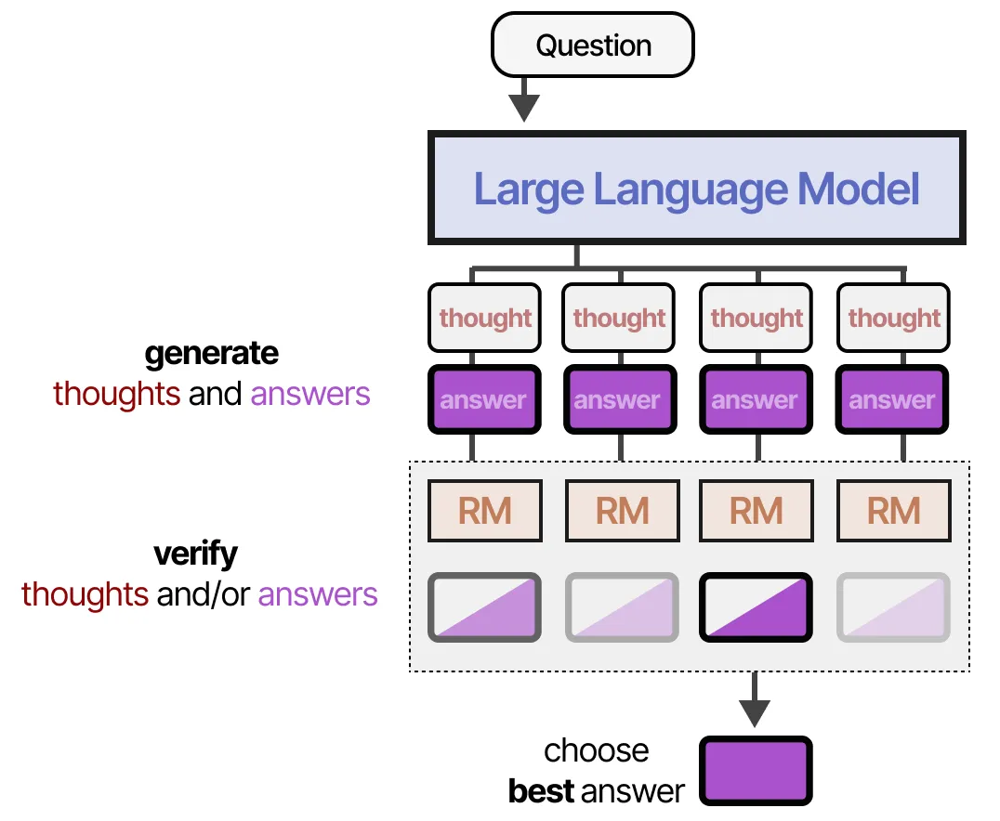

The verifier is typically a LLM, fine-tuned for either judging the outcome (ORM) or the process (PRM).

A major advantage of using verifiers is that there is no need to re-train or fine-tune the LLM that you use for answering the question.

## Majority Voting

The most straightforward method is actually not to use a reward model or verifier but instead, perform a majority vote.

We let the model generate multiple answers and the answer that is generated most often will be the final answer.

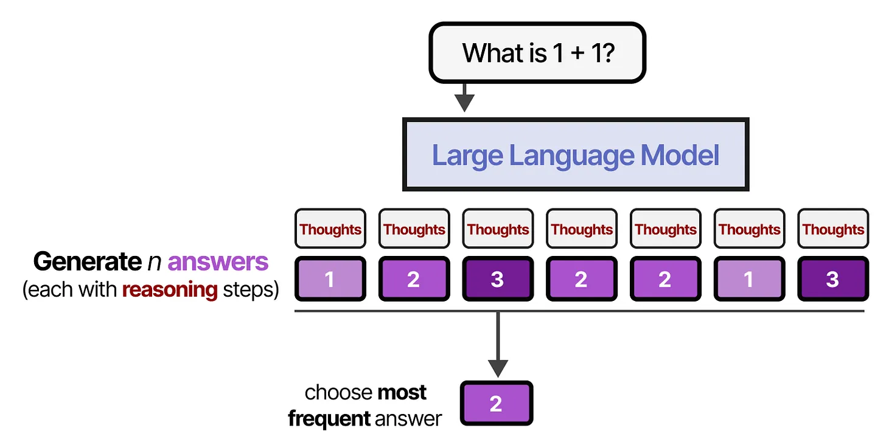

This method is also called self-consistency6 as a way to emphasize the need for generating multiple answers and reasoning steps.

## Best-of-N samples

The first method that involves a verifier is called Best-of-N samples. This technique generates N samples and then uses a verifier (Outcome Reward Model) to judge each answer:

First, the LLM (often called the Proposer) generates multiple answers using either a high or varying temperature.

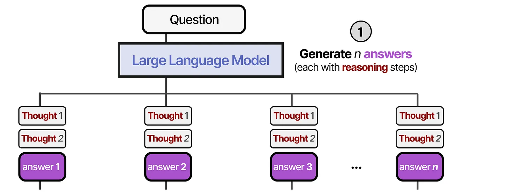

Second, each answer is put through an Output Reward Model (ORM) and scored on the quality of the answer. The answer with the highest score is selected:

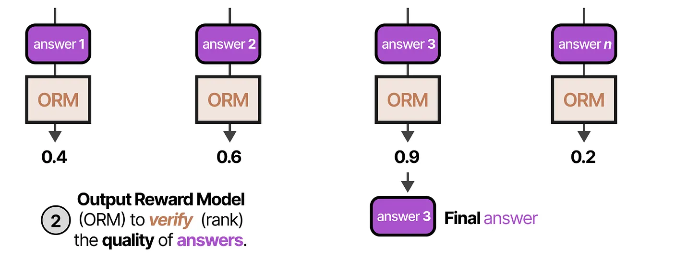

Instead of judging the answer, the reasoning process might also be judged with a Process Reward Model (PRM) that judges the quality of each reasoning step. It will pick the candidate with the highest total weight.

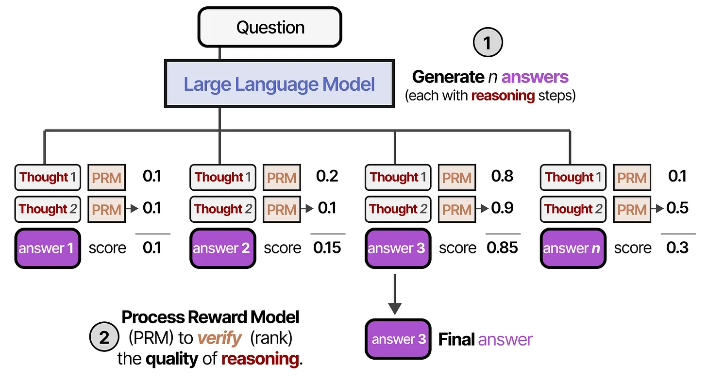

With both verifier types, we can also weigh each answer candidate by the RM and pick the one with the highest total weight. This is called Weighted Best-of-N samples:

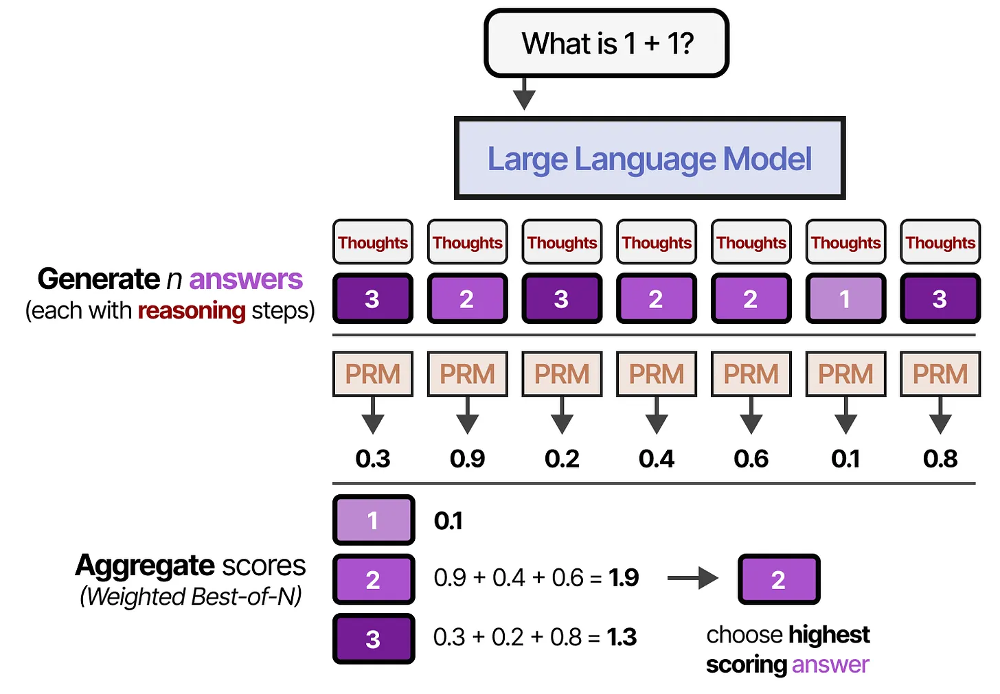

## Beam search with process reward models

This process of generating answers and intermediate steps can be further extended with beam search. With beam search, multiple reasoning steps are sampled and each is judged by PRM (similar to Tree of Thought7). The top 3 “beams” (best-scoring paths) are tracked throughout the process.

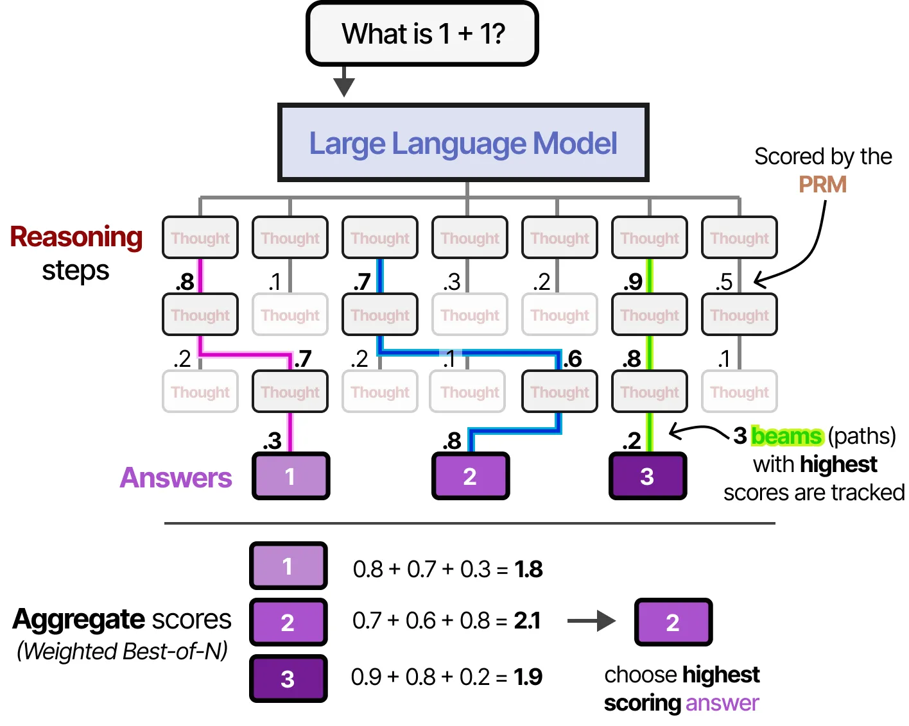

This method allows for quickly stopping “reasoning” paths that do not end up to be fruitful (scored low by the PRM).

The resulting answers are then weighted using the Best-of-N approach we explored before.

## Monte Carlo Tree Search

A great technique for making the tree searches more efficient is called Monte Carlo Tree Search. It consists of four steps:

- Selection (select a given leaf based on a pre-determined formulate)
- Expand (create additional nodes)
- Rollouts (randomly create new nodes until you reach the end)
- Backprop (update parent node scores based on output)

The main goal of these steps is to keep expanding the best reasoning steps while also exploring other paths.

It is therefore a balance between exploration and exploitation. An example of how nodes are scored and selected is as follows:

Thus, when we select a new reasoning step to explore, it does not have to be the best-performing path thus far.

Using this type of formula, we start by selecting a node (reasoning step) and expand it by generating new reasoning steps. As before, this can be done with reasonably high and varying values of temperature:

One of the expanded reasoning steps is selected and rolled out multiple times until it reaches several answers.

These rollouts can be judged based on the reasoning steps (PRM), the rewards (ORM), or a combination of both.

The scores of the parent nodes are updated (backpropagated) and we can start the process again starting with selection.

Modifying Proposal Distribution
The second category of making reasoning LLMs is called “Modifying Proposal Distribution”. Instead of searching for the correct reasoning steps with verifiers (output-focused), the model is trained to create improved reasoning steps (input-focused).

In other words, the distribution from which completions/thoughts/tokens are sampled is modified.

Imagine that we have a question and a distribution from which we can sample tokens. A common strategy would be to get the highest-scoring token:

However, note that some of the tokens are colored red in the image above. Those are the tokens that are more likely to lead to a reasoning process:

Although taking the greedy token is not necessarily wrong, selecting a token leading to a reasoning process tends to result in an improved answer.

When we modify the proposal distribution (the token probability distribution), we are essentially making it so that the model re-ranks the distribution such that “reasoning” tokens are selected more frequently:

There are various methods for modifying the proposal distribution but they can be generally put in two categories:

Updating the prompt through prompt engineering

Training the model to focus on reasoning tokens/processes

Prompting
With prompt engineering, we are attempting to improve the output by updating the prompt. This process might also nudge the model to showcase some of the reasoning processes we saw before.

To change the proposal distribution with prompting, we can provide examples to the model (in-context learning) that it has to follow to generate reasoning-like behavior:

This process can be further simplified by simply stating “Let’s think step-by-step”8. Likewise, this changes the proposal distribution in such a way that the LLM tends to break down the process before answering:

However, the model has not inherently learned to follow this process. Moreover, this is a static and linear process that inhibits self-refinement. If a model starts with an incorrect reasoning process it tends to keep it instead of revising it.

STaR
Aside from prompting, we can also have the model learn to “reason” by having it train so that it is rewarded for generating these reasoning steps. This typically involves a bunch of reasoning data and reinforcement learning to reward certain behaviors.

A much-debated technique is called STaR or Self-Taught Reasoner9. STaR is a method that uses the LLM to generate its own reasoning data as the input for fine-tuning the model.

In the first step (1), it generates reasoning steps and an answer. If the answer is correct (2a), then add the reasoning and answer to a triplet training data set (3b). This data is used to perform supervised fine-tuning of the model (5):

If however, the model provides an incorrect answer (2b), then we provide a “hint” (the correct answer) and ask the model to reason why this answer would be correct (4b). The final reasoning step is to add to the same triplet training data which is used to perform supervised fine-tuning of the model (5):

A key element here (along with many other techniques for modifying the proposal distribution) is that we explicitly train the model to follow along with the reasoning processes we show it.

In other words, we decide how the reasoning process should be through supervised fine-tuning.

The full pipeline is quite interesting as it essentially generates synthetic training examples. Using synthetic training examples (as we will explore in DeepSeek R-1) is an incredible method of also distilling this reasoning process in other models.

DeepSeek-R1
A major release in reasoning models is DeepSeek-R1, an open-source model whose weights are available10. Directly competing with the OpenAI o1 reasoning model, DeepSeek-R1 has had a major impact on the field.

DeepSeek has done a remarkable job at elegantly distilling reasoning into its base model (DeepSeek-V3-Base) through various techniques.

Interestingly, no verifiers were involved and instead of using supervised fine-tuning to distill reasoning behavior, a large focus was on reinforcement learning.

Let’s explore how they trained reasoning behavior in their models!

Reasoning with DeepSeek-R1 Zero
A major breakthrough leading to DeepSeek-R1 was an experimental model called DeepSeek-R1 Zero.

Starting with DeepSeek-V3-Base, instead of using supervised fine-tuning on a bunch of reasoning data, they only used reinforcement learning (RL) to enable reasoning behavior.

To do so, they start with a very straightforward prompt (similar to a system prompt) to be used in the pipeline:

Note how they explicitly mention that the reasoning process should go between <think> tags but they do not specify what the reasoning process should look like.

During reinforcement learning, two specific rule-based rewards were created:

Accuracy rewards - Rewards the answer by testing it out.

Format rewards - Rewards using the <thinking> and <answer> tags.

The RL algorithm used in this process is called Group Relative Policy Optimization (GRPO)11. The intuition behind this algorithm is that it makes all choices that led to a correct or incorrect answer more or less likely. These choices can be both sets of tokens as well as reasoning steps.

Interestingly, no examples were given on how the <think> process should look like. It merely states that it should use <think> tags, and nothing more!

By providing these indirect rewards related to Chain-of-Thought behavior, the model learned by itself that the longer and more complex the reasoning process, the more likely the answer was correct.

Annotated figure from “DeepSeek-R1: Incentivizing Reasoning Capability in LLMs via Reinforcement Learning”. By using indirect RL rewards, the model freely explores the most optimal Chain-of-Thought like behavior through ever increasing reasoning steps.
This graph is especially important as it reinforces the paradigm shift from train-time compute to test-time compute. As these models generate longer sequences of thoughts, they focus on test-time compute.

Using this training pipeline, they found that the model discovers on its own the most optimal Chain-of-Thought-like behavior, including advanced reasoning capabilities such as self-reflection and self-verification.

However, it still had a significant drawback. It had poor readability and tended to mix languages. Instead, they explored an alternative, the now well-known DeepSeek R1.

Let’s explore how they stabilized the reasoning process!

DeepSeek-R1
To create DeepSeek-R1, the authors followed five steps:

Cold Start

Reasoning-oriented Reinforcement Learning

Rejection Sampling

Supervised Fine-Tuning

Reinforcement Learning for all Scenarios

In step 1, DeepSeek-V3-Base was fine-tuned with a small high-quality reasoning dataset (≈5.000 tokens). This was done to prevent the cold start problem resulting in poor readability.

In step 2, the resulting model was trained using a similar RL process as was used to train DeepSeek-V3-Zero. However, another reward measure was added to make sure the target language remained consistent.

In step 3, the resulting RL-trained model was used to generate synthetic reasoning data to be used for supervised fine-tuning in a later stage. Through rejecting sampling (rule-based rewards) and a reward model (DeepSeek-V3-Base), 600,000 high-quality reasoning samples were created.

Moreover, 200,000 non-reasoning samples were created by using DeepSeek-V3 and part of the data it was trained on.

In step 4, the resulting dataset of 800,000 samples was used to perform supervised fine-tuning of the DeepSeek-V3-Base model.

In step 5, RL-based training was performed on the resulting model using a similar approach used in DeepSeek-R1-Zero. However, to align with human preferences, additional reward signals were added focused on helpfulness and harmlessness.

The model was also asked to summarize the reasoning process to prevent readability issues.

And that’s it! This means that DeepSeek-R1 is actually a fine-tune of DeepSeek-V3-Base through supervised fine-tuning and reinforcement learning.

The bulk of the work is making sure that high-quality samples are generated!

Distilling Reasoning with DeepSeek-R1
DeepSeek-R1 is a huge model with 671B parameters. Unfortunately, this means running such a model is going to be difficult on consumer hardware.

Fortunately, the authors explored ways to distill the reasoning quality of DeepSeek-R1 into other models, such as Qwen-32B, which we can run on consumer hardware!

To do so, they use the DeepSeek-R1 as a teacher model and the smaller model as a student. Both models are presented with a prompt and have to generate a token probability distribution. During training, the student will attempt to closely follow the distribution of the teacher.

This process was done using the full 800,000 high-quality samples that we saw before:

The resulting distilled models are quite performant since they not just learned from the 800,000 samples but also the way the teacher (DeepSeek-R1) would answer them!

Unsuccessful Attempts
Remember when we talked about Process Reward Models (PRMs) and Monte Carlo Tree Search (MCTS)? It turns out that DeepSeek also tried those techniques to instill reasoning but was not successful in doing so.

With MCTS, they encountered issues with the large search space and had to limit the node expansions. Moreover, training a fine-grained Reward Model is inherently difficult.

With PRMs for Best-of-N techniques, they encountered issues with computational overhead to keep re-training the Reward Model to prevent reward-hacking.

This does not mean these are not valid techniques but it provides interesting insights into the limitations of these techniques!

# Reference

[A Visual Guide to Reasoning LLMs](https://newsletter.maartengrootendorst.com/p/a-visual-guide-to-reasoning-llms?fbclid=IwZXh0bgNhZW0CMTEAAR1B6zMf1AOyc_tM2b3EoDlitLngHtL-LOCzDC0NmL27NP30zR7cz_HO1WM_aem_gB4M6AuC2Kh2TTrP1W3N5Q)